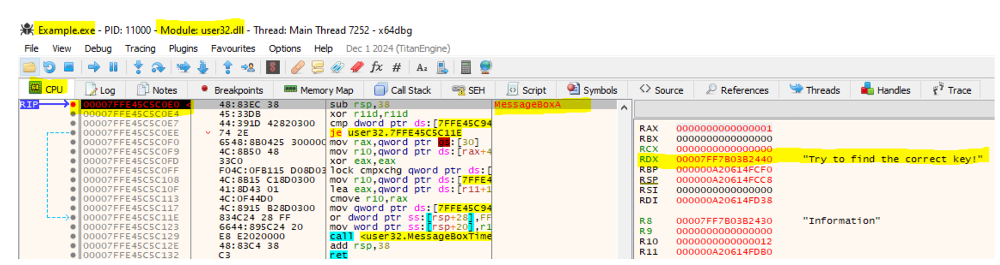

# Fatmike's Loader (in-memory patcher)  

A Windows executable 'loader' (in-memory patcher) for x86 and x64 targets, designed for controlled in-memory patching of executables (PE images).  

**Note**:  
Not to be confused with a manual mapper like this one: https://github.com/Fatmike-GH/PELoader

**Keywords**:  
Loader, in-memory patcher, in-memory patching, portable executable, EXE, Windows

## Motivation

When solving a crackme, the preferred way is to find a valid serial or to write a keygen. If that isn’t possible, patching the binary is a common fallback. Packed targets are usually unpacked first so patches can be persisted to disk. If unpacking fails, a *loader* can be used for in-memory patching.

## Requirements

- **Target Executable Loading:** The loader must be capable of loading and preparing a target executable for execution.

- **Execution Flow Control:** The ability to manage the program flow of the target process.

- **Remote Process Patching:** Functionality to apply modifications directly to the memory of the remote process at runtime.

- **Remote Memory Allocation:** The capability to allocate new memory regions within the address space of the target process.  
  
## Implementation

### Target Executable Loading  

The target process is launched in a suspended state by utilizing the ``CreateProcess`` API with the ``CREATE_SUSPENDED`` flag. This ensures the process is created and its memory is mapped, but it prevents any code from executing, which allows the loader to perform necessary modifications beforehand.

### Execution Flow Control  

To gain control of the target's execution flow, a custom breakpoint mechanism is used instead of the standard Windows Debugging API. This method works as follows:

- **Breakpoint Placement:** The instruction at a desired address is overwritten with an infinite loop (specifically, ``jmp EIP`` for x86 or ``jmp RIP`` for x64). This acts as a manual breakpoint.  
- **Hit Detection:** After the target's main thread is resumed, the loader continuously polls the thread's instruction pointer using ``GetThreadContext``. A breakpoint is considered "hit" when the value in the ``EIP`` (or ``RIP``) register matches the address of the placed infinite loop, confirming that execution has reached the intended location.

Breakpoints can be placed within the target's main executable or its loaded modules. To find functions addresses in the remote process, I implemented custom ``GetRemoteModuleHandle`` and ``GetRemoteProcAddress`` methods. This avoids more complex techniques like code injection for address resolution.

### Remote Process Patching

The ``WriteProcessMemory`` API is used to apply patches to the target's memory at a specific Virtual Address (VA) or Relative Virtual Address (RVA). Similarly, the thread's registers are accessed and modified using ``GetThreadContext`` and ``SetThreadContext``, respectively.  

### Remote Memory Allocation

Memory allocation in the target process is performed using ``VirtualAllocEx``.

## Solution Overview

### Example Project

The Example project is a simple console application designed to serve as the demonstration target for the Loader. It contains two specific features that are modified at runtime: a basic key validation check, which is bypassed, and a message box whose text is altered.

### Loader Project

#### ``class Loader``

The core of the solution is the ``Loader`` class, which encapsulates all functionality required for manipulating the target process. It provides a high-level interface for process creation, execution control, and memory modification.

- ``CreateSuspended`` Initializes and launches the target process in a suspended state, which allows for modifications to be made before any code is executed.
- ``Suspend`` Pauses the main thread of the target process.
- ``Resume`` Resumes execution of the main thread.
- ``ResumeUntilVa`` Executes the target's main thread until the instruction pointer reaches a specified Virtual Address (VA). It then automatically suspends the thread and returns its current context.
- ``ResumeUntilRva`` Functions similarly to ResumeUntilVa, but runs the target until a specified Relative Virtual Address (RVA) within the main executable module is reached.
- ``ResumeUntilApi`` Runs the target process until a specific API function is called. Upon entry to the function, it suspends the thread and returns its context.
- ``AllocateMemory`` Allocates a new region of memory within the virtual address space of the target process.
- ``WriteToVa`` Writes a supplied data buffer to a specific Virtual Address (VA) in the target's memory.
- ``WriteToRva`` Writes data to a Relative Virtual Address (RVA) within the main module of the target.
- ``UpdateContext`` Applies a modified context structure to the main thread, allowing direct manipulation of CPU registers.

#### ``class ModuleResolver``

The ``ModuleResolver`` is a utility class responsible for parsing the remote process's memory to find loaded modules and their exported functions. It provides functionality analogous to the standard Windows APIs but is specifically designed to operate on an external target process.

- ``GetRemoteModuleHandle`` Retrieves the base address (handle) of a specified module that has been loaded into the target process's address space.
- ``GetRemoteProcAddress`` Finds and returns the memory address of an exported function within a given module in the remote process.

#### ``class BreakPoint``

The ``BreakPoint`` class encapsulates the state and behavior of a single breakpoint. It manages the entire lifecycle of a breakpoint, from activation to deactivation, by handling the necessary memory modifications in the target process.

- ``Enable`` Activates the breakpoint by replacing the original instruction at the specified address with a breakpoint instruction (e.g., ``jmp EIP``). The original instruction is saved internally.
- ``Disable`` Deactivates the breakpoint by restoring the original instruction that was overwritten when the breakpoint was enabled, allowing normal execution to resume.
- ``GetVA`` Returns the virtual address (VA) where the breakpoint is located within the target process's memory.

#### ``main``

The main function serves as a practical demonstration, orchestrating the ``Loader`` class to patch the ``Example.exe`` binaries provided in the *Demo* folder. The example executables are packed with *UPX* (version 5.0.1), to have a more realistic scenario. The virtual addresses used in the code correspond directly to these specific binaries (x64 and x86). *Debug* configuration was used to build these binaries.

- **Bypass the UPX Packer**: Before any modifications can be made, the loader must allow the *UPX* unpacking stub to finish its work. This is accomplished by resuming the process and setting a breakpoint when jumping to the Original Entry Point (OEP) of the application. The ``loader.ResumeUntilRva()`` method is used to halt execution precisely at the moment the unpacked code is about to run.
- **Apply In-Memory Patches**: With the application now fully unpacked in memory, the following modifications are applied:
  - **Disable a Key Check**: A check for a secret key is neutralized by overwriting the relevant assembly instructions with ``NOP`` (No-Operation) opcodes. This is performed using the ``loader.WriteToRva()`` method.
  - **Modify Message Box Content**: The text displayed in a message box is altered. This requires a multi-step approach:
    - First, new memory is allocated in the remote process via ``loader.AllocateMemory()``.
    - The custom message string is then written into this new memory region.
    - Finally, the loader modifies the thread's context to redirect the pointer for the message box text. This involves changing the value in the RDX register (for x64) or updating a value on the stack at ESP+0x8 (for x86) to point to our newly allocated string.
- **Resume Execution**: Once all patches have been successfully applied, the target process is resumed, allowing the now-modified application to run normally.

## Appendix

### Calculating required RVAs (x64)

#### ImageBase

  

**Image Base:** 0x00007FF7B0390000

#### Jmp OEP

  

**JMP OEP:** 0x00007FF7B03C23CB  
**RVA:** 0x00007FF7B03C23CB - 0x00007FF7B0390000 = 0x000323CB

#### Patch For Conditional Jump  

  

**JE:** 0x00007FF7B03A7C8C  
**RVA:** 0x00007FF7B03A7C8C - 0x00007FF7B0390000 = 0x00017C8C

#### Patch For MessageBoxA  

**RDX:** Holds VA of message box parameter
